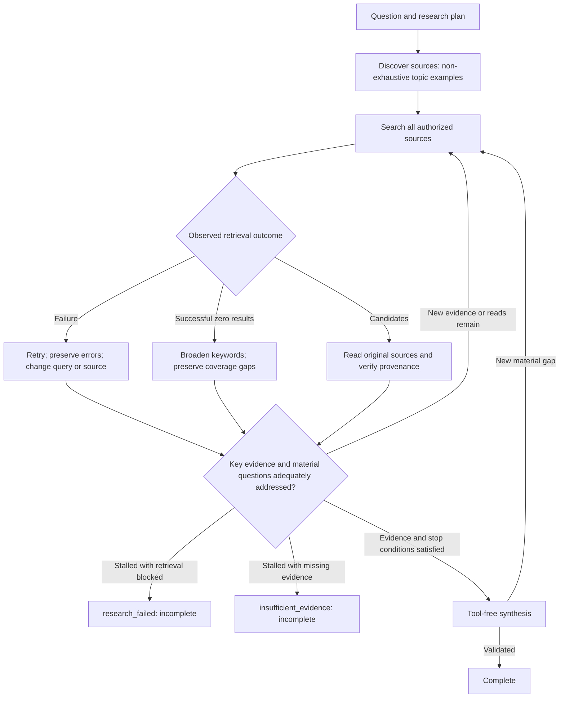

# Signal Desk research runtime integration

[中文](../signal-desk-research.md)

Research mode searches public sources and the personal subscription index through one local gateway. The Claude and DeepSeek loops in `forecast-engine`, and the Hongshu repository's OpenRouter `orgpt.py --tools`, use this gateway.

## Unlimited default rounds and completion checks (2026-09-14)

The default three-round cap is removed from the CLI, HTTP, MCP and Raven UI. Omitted `maxRounds` or `0` means unlimited. Direct engine calls can still use an explicit `FORECAST_MAX_ROUNDS` budget; an explicit argument takes precedence. Positive integers are operator-selected total research-round budgets, without the former 1–6 or 1–20 ceiling. Each research round may contain many searches. Probability calculations and evidence weighting are unchanged.



| Situation | Engine and presentation behavior |
| --- | --- |
| Tool failure | Automatic retrieval retries once; failures remain failures, not empty successes. Available results from other branches are retained. |
| Successful zero results | Precollection broadens combined keywords into individual original keywords. The model is instructed to rephrase and search across sources. No match does not establish absence. |
| Missing key evidence or unresolved material questions | Research continues. Two consecutive passes without new usable evidence, new actual reads, or reduced gaps return an incomplete status and reason. Invalid claims and repeated identical read ranges do not manufacture progress. |
| Evidence and normal stopping criteria satisfied | Synthesis is allowed. An unchanged probability or empty search alone is insufficient. Material questions found in synthesis reopen research. |
| Explicit budget exhausted | `max_rounds` is incomplete, with no summary. Raise the budget or set `0` to continue. |
| Interruption or synthesis failure | Persist state and pending synthesis. Resume without applying evidence twice; partially committed state cannot appear complete. |

Precollection and targeted follow-up searches count as actual search coverage. Their cached text does not count as model reading: the model's successful read-tool return is required. Required library retrieval is tracked per target; searching one company cannot erase another company's failures.

Incomplete reports retain evidence, history and provisional estimates. Final API `answer`, `probability` and `verdict` are null; the provisional value is available under `workingEstimate.provisional=true`, with `isFinal=false`. Raven shows actual rounds without a fixed `/3` denominator. Historical three-round demos remain historical.

Source profiles replace `can_provide` with `topic_examples`, with a non-exhaustive scope note on every publisher, unknown source and local branch. A general initial `web_search` includes all authorized sources, including macro, energy and unknown publishers whose examples omit TPU. Later retrieval follows evidence and explicit user scope. Participation does not guarantee a hit or require reading irrelevant articles in full.

The evidence ledger remains for provenance, syndication deduplication, probability attribution and recovery. Retrieval outcomes separately identify results, zero results, partial failures and failures. The ledger is not a research budget and does not require turning every article into a claim.

Regression checks use simulated models and temporary local indexes, covering binary and typed research beyond three rounds, failure versus zero results, per-company coverage recovery, new original reads, explicit budgets and hard-interruption recovery. No additional paid model research was run. Review `src/research-progress.ts`, `src/research-tools.ts` and the private gateway's `source_profiles.py`.

## Run

From the Hongshu repository:

```bash
python3 scripts/research.py --start-date 2026-03-11 --end-date 2026-09-11 check
python3 scripts/research.py --start-date 2026-03-11 --end-date 2026-09-11 forecast \
  --question "Will Meta lower its capital expenditure guidance within six months?"
python3 scripts/research.py --start-date 2026-03-11 --end-date 2026-09-11 orgpt \
  --prompt-file path/to/research-prompt.md --out path/to/report.md
```

Dates constrain the subscription catalogue, not the forecast horizon, and may be ingestion dates rather than publication dates. Framing must define the question's resolution criteria; historical research must verify original publication dates.

Configure `forecast_repo` in `~/.config/raven/research/runtime.json`, or set `RAVEN_FORECAST_REPO` to an integrated checkout. This integration was ported onto current main, preserving research planning and claim cross-checking. The service implementation stays in the personal private workspace; this public repository contains only the generic process adapter. Credentials and subscription content are not distributed with it.

Direct engine invocation:

```bash
FORECAST_SIGNAL_DESK=1 FORECAST_SIGNAL_DESK_COMMAND="$HOME/.local/bin/raven-signal-desk" \
  pnpm forecast:event -- "Research question"
```

The feature is off globally and enabled by the dedicated launcher. `FORECAST_PROVIDER=deepseek` selects the OpenAI-compatible loop; otherwise Claude uses its existing CLI model/auth configuration. The Codex provider does not yet support this gateway and explicitly rejects Signal Desk mode instead of silently omitting subscription search. No trading, orders, scheduling, shared deployment or public website integration was added.

## Tools and routing

| Tool | Behavior |
| --- | --- |
| `web_search` | Always searches public sources and Signal Desk; no default local candidate ceiling; separate source statuses |
| `fetch_page` | Reads public pages; exact subscription Markdown URLs use authenticated reading |
| `signal_desk_search` | Keyword, date, publisher, title/body and pagination filters |
| `signal_desk_read` | Reads Markdown by article ID, distinguishing summaries and full articles |
| `signal_desk_pdf` | Downloads or reuses a cached report, returning numbered pages of extracted text |
| `research_images` | Discovers inline image candidates and context; discovery does not download or visually read them |
| `research_image` | Retrieves a figure by image ID, question and importance reason; accepts `observation` after actual visual review to archive notes |

Claude research mode loads these tools via `--mcp-config` and disables built-in tools so general searches go through the gateway. OpenRouter and DeepSeek consume the same schemas and `research-call` dispatch. Explicit tool-disabled summary calls remain disabled.

Public search uses Exa/Tavily environment credentials when available, otherwise DuckDuckGo. Errors such as HTTP 403 or timeout remain visible per source, while successful results from the other source are retained. `research_keywords=["Meta","capex"]` requires both literal keywords. Chinese Meta questions have basic entity/topic extraction; supply concise keywords for complex queries.

## Evidence boundaries

- Results preserve stable URLs, provider, content type, coverage and read ranges. `search_candidate` is discovery; `summary_verified` identifies retrieved summary text; `body_verified` identifies retrieved article or PDF text. These labels neither certify claims nor imply the whole document was read.
- The engine uses successful tool `source_urls` for trace membership. Failed private reads do not pass through a URL-liveness fallback. Links embedded in retrieved text do not become verified sources automatically.
- Catalogue coverage differs from indexed-body coverage. Many Foreign Research entries are title-only. Zero matches do not establish absence, and public search dates are not a hard filter.
- The former local five-download budget has been removed for this research. Upstream permission/rate-limit errors remain visible. PDF extraction can omit figures/tables or truncate page text; inspect the original when numerical accuracy matters. Searches do not bulk-download reports.
- The existing local service owns the key; it is not a model argument or repository file. Retrieved subscription material is sent to the configured model for authorized personal research. Reports should summarize and cite rather than reproduce complete articles.

## Audit and validation

The launcher creates private `~/.local/share/raven/signal-desk/research-runs/<runId>/` artifacts for requests, output, exit status and tool traces. Parsed model outputs, reported model/usage where available and retrieval traces are saved in the adjacent `.models.jsonl` file. Tool traces omit complete bodies, keys and temporary signed links; the existing service owns the content cache.

Validation covers schema/error behavior, trace integrity, complete JSON pagination and legacy public-search compatibility. A real Claude MCP run completed combined search and summary reading: both sources succeeded and the model correctly reported 500 characters read with more content remaining. Detailed acceptance evidence remains in the private local run directory. OpenRouter and DeepSeek loops were tested with simulated model responses rather than additional paid model calls. Service validation includes real search/read and cached PDF page extraction.

Research cost coverage is marked `partial` when external search costs are not included in the model bill.

When rerunning an existing question, pass its original `--resolution`. The engine preserves those supplied criteria after both framing and audit; caveats may identify ambiguities but cannot rewrite the pinned rules.

When model output fails validation, the engine records the specific error and provides it with the previous output for one correction attempt. Rejected output never changes the probability. Retries retain actual retrieved sources and deduplicated queries, and aggregate known model cost and usage. Unsupported statements cannot pass merely by relabeling a source.

## Required use and answer types

The personal launcher also sets `FORECAST_REQUIRE_EXPANDED_LIBRARY=1`: binary and typed research pre-search/read the library and require an exact quotation or specific exclusion. Comparisons cover each entity. User-facing text calls this the “expanded resource library.” See [answer types](forecast-answer-types.md).


## Unified discovery and progressive reading (2026-09-14)

`forecast-engine` adds `research_sources` to the same gateway registry as the existing five tools. The model first discovers public web, expanded resource library, and authorized local interviews, optionally inspects a `publisher`, then uses `web_search` to find candidates and progressively reads relevant material. Existing tool names remain compatible. Source perspective (sell-side, buy-side, independent, unknown) is context, not a substitute for independent assessment of facts, assumptions, and incentives. The model must not adopt an author's ready-made investment conclusion.

Local sources use stable `raven-local://<id>` identifiers and are read with `fetch_page`. The adapter accepts nonempty IDs containing letters, digits, dots, underscores, and hyphens, without paths, query parameters, credentials, or arbitrary `file:` addresses. Verified reading still requires successful status, readable content, and an explicit access label. Discovery/search alone does not count as a full read, and failed results cannot become verified reading. Existing expanded-library evidence requirements, answer types, and probability calculations are preserved.

Signal Desk mode no longer applies the gateway's 1 MB rejection, 90-second gateway timeout, 360-second model-loop timeout, or DeepSeek's defaults of 8 model responses, 14 tool executions, and 6000 output tokens. Complete tool JSON, read ranges, and continuation metadata are retained. Models and upstream services may still impose context, response size, access, or rate limits; errors must be reported explicitly. Non-Signal-Desk public-search mode retains its default budgets. The Claude adapter did not set a tool-count limit.

Operators may explicitly configure `FORECAST_RESEARCH_TIMEOUT_MS` (one gateway invocation), `FORECAST_AGENT_TIMEOUT_MS` (a model invocation including its tool loop), `FORECAST_MAX_MODEL_TURNS`, and `FORECAST_MAX_TOOL_CALLS` (the last two apply to DeepSeek). Values must be non-negative integers; `0` means unlimited. Gateway duration is unlimited by default, so the adapter no longer interrupts OCR after 90 seconds. When multiple deadlines are configured, the smaller remaining budget applies. Invalid configuration fails visibly. `--max-rounds` retains its meaning as the outer answer/probability iteration count.

Validation uses simulated models, controlled subprocesses, and existing engine regressions, including Chinese responses larger than 1 MB, more than 8 turns / 14 tools, local-source reading traces, explicit caps, and error paths. No paid model calls are needed.

Expanded-library prefetch and gap follow-up also remove fixed query/page/article/PDF counts, gaps per round, two-attempt ceilings, public-page counts, and 8000/6500-character clipping. They fetch complete available content and follow upstream continuation. Explicit caller article/PDF limits remain visible in the audit (`null` means no limit). `max_chars=0` and `max_pages=0` request complete available content. Full received text remains in private state; repeated model prompts carry the complete source directory, hashes, ranges, lengths, and retrieval coordinates. The model chooses the ranges to read, without automatically copying every body into every stage or treating a directory as model reading.

PDF results marked `status=partial, access=body_partial` retain only the actually returned pages and can substantiate exact short quotations from those pages. They never establish full extraction: missing pages, truncation, and extraction warnings remain visible and cannot satisfy a whole-document completion claim. Access failures and responses without readable text still do not count as reading.

In directory mode, claim citations and gap closure now require actual model reading in code. Private prefetch or a search hit alone does not pass. Sources previously supplied inline by older runtimes retain compatibility provenance when switching to a directory. Source tracing and exact-quote checks both remain active.


## Material inline figures (2026-09-15)

The research model selects charts, tables and substantive diagrams in the article body that can change facts, assumptions or conclusions for the current question. It skips decorative photos, avatars, logos and unrelated figures. It first discovers candidates with `research_images`, then supplies a concrete `importance_reason` to `research_image`. After actually seeing the image, it checks axes, units, period, actual/forecast labels, key observations and limitations, and archives notes through the same tool's `observation` field. Unclear images cannot support precise numbers.

Claude receives images through native MCP image content; JSON text carries metadata. The current DeepSeek adapter only supports text messages: it removes `_image_content`, explicitly reports `visual_review_unavailable`, and rejects visual-observation writes. It neither sends base64 as text nor equates downloading with visual review. Use an image-capable route when review is needed; there is no automatic model switch.

Image discovery, retrieval, visual interpretation and article text reading remain separate. `image_retrieved`, captions and OCR do not count as `body_verified`; visual observations are not verbatim article quotations. Material figures that cannot be retrieved or read remain research gaps. No detected images does not prove complete graphic coverage. Adapter regressions use simulated models and native MCP content fixtures without additional paid model calls.
