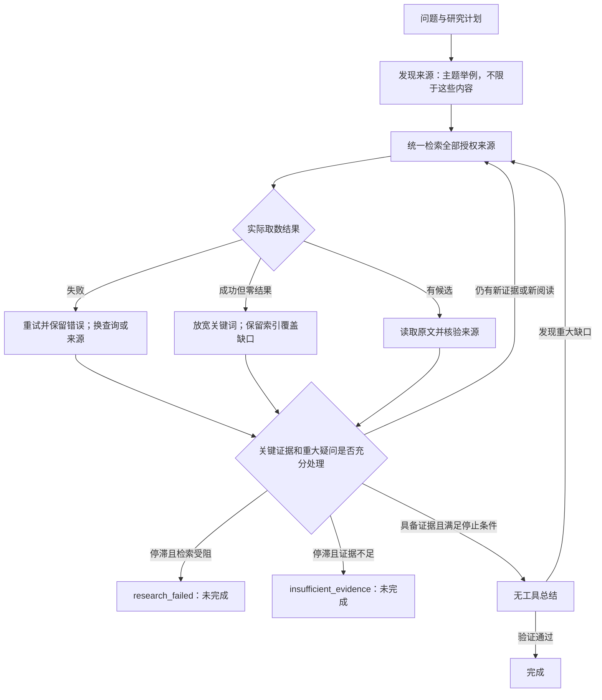

# Signal Desk 投研运行接入

[English](en/signal-desk-research.md)

研究模式通过本机网关同时搜索公开资料和个人订阅材料。接入点是 `forecast-engine` 的 Claude / DeepSeek 工具循环；红薯仓库的 OpenRouter `orgpt.py --tools` 也使用相同网关。

## 默认不限研究轮次与完成条件（2026-09-14）

已取消默认最多 3 轮：CLI、HTTP、MCP、Raven 页面均默认不限研究轮次；不传 `maxRounds` 或传 `0` 表示不限。直接运行引擎时，显式 `FORECAST_MAX_ROUNDS` 仍可设置预算，显式参数优先；正整数是操作者主动设置的总研究轮次预算，不再限制为 1–6 或 1–20。每轮内部可以进行多次搜索，研究轮数不是搜索次数。概率计算与证据权重规则保持原有实现。



| 情况 | 引擎与界面行为 |
| --- | --- |
| 工具失败 | 自动检索先重试一次；失败仍记为失败，不伪装成零结果。可用的其他分支结果继续保留。 |
| 成功但零结果 | 预收集从组合关键词放宽到原关键词单项；模型收到改写查询、跨来源搜索的指令。零命中不代表资料不存在。 |
| 缺关键证据或重大疑问未解决 | 继续研究；连续两轮没有新增有效证据、没有新增实际阅读、没有缩小缺口时，返回未完成状态及原因。无效断言和重复读同一范围不延长研究。 |
| 具备有效证据且研究停止条件成立 | 可以正常总结；单凭概率没变或没搜到东西不算完成。总结发现重大疑问会重新进入研究。 |
| 显式预算耗尽 | `max_rounds` 表示未完成，摘要为空。后续可提高预算或改为 `0` 继续。 |
| 进程中断或总结失败 | 保存状态与待完成总结；恢复时避免重复应用证据，不能把落盘一半的结果当成完成。 |

预收集与定向补搜均计入实际搜索轨迹，但只有模型读取工具的成功返回才算模型已读。比较题按目标分别追踪必需扩展库检索，不能用搜到一家公司的结果冲销另一家公司失败的记录。

未完成报告保留证据、历史和暂定估计；API 的最终 `answer`、`probability`、`verdict` 为空，另以 `workingEstimate.provisional=true` 返回暂定值，`isFinal=false`。Raven 显示实际已运行轮数，不使用固定 `/3` 分母；演示历史仍保留当时的 3 轮。

来源字段已从 `can_provide` 改为 `topic_examples`，每个专区、未知来源、本地分支均附非穷尽说明。一般首次 `web_search` 覆盖全部授权来源，介绍中没列 TPU 的宏观、能源或未知专区也参与；后续按实际线索定向选读，用户明确指定范围时遵循该范围。参与检索不保证每个来源有命中，也不要求无关内容全部阅读全文。

证据账本继续保留，用于来源追溯、同源去重、概率变动解释和中断恢复；查询结果另记录成功、零结果、部分失败或失败。它不是额外研究预算，也不强迫模型把每篇文章写成证据。

本次回归使用模拟模型和临时本地索引：包含二元与多选型研究超过 3 轮、错误与零结果、按公司恢复覆盖、原文阅读进展、预算耗尽及硬中断恢复；未新发付费模型研究。可审阅 `src/research-progress.ts`、`src/research-tools.ts` 和私有网关的 `source_profiles.py`。

## 运行方式

在红薯仓库运行：

```bash
python3 scripts/research.py --start-date 2026-03-11 --end-date 2026-09-11 check
python3 scripts/research.py --start-date 2026-03-11 --end-date 2026-09-11 forecast \
  --question "未来六个月 Meta 是否会下调资本开支指引？"
python3 scripts/research.py --start-date 2026-03-11 --end-date 2026-09-11 orgpt \
  --prompt-file path/to/research-prompt.md --out path/to/report.md
```

重跑已有问题时，传入原来的 `--resolution`；引擎在审题和复核之后均保留这段原文，复核意见不能悄悄改写条件。

日期是订阅目录的检索窗口，不是预测事件的期限，也不保证是原始发布日期。问题中的“六个月”须由 framing 明确结算标准；历史研究还须核验正文原始日期。

个人工作流在 `~/.config/raven/research/runtime.json` 中设置 `forecast_repo`，或通过 `RAVEN_FORECAST_REPO` 指向含本接入的 checkout。本次已将接线迁移到最新 main，保留研究规划和证据交叉核验逻辑。Signal Desk 的服务实现由个人私有工作区维护，公开仓库只包含通用进程调用适配器；内容缓存和凭证不随代码分发。

直接调用本引擎时，显式设置：

```bash
FORECAST_SIGNAL_DESK=1 FORECAST_SIGNAL_DESK_COMMAND="$HOME/.local/bin/raven-signal-desk" \
  pnpm forecast:event -- "研究问题"
```

全局默认关闭；上述专用入口自动开启。`FORECAST_PROVIDER=deepseek` 使用 OpenAI-compatible 工具循环；默认 Claude 使用 CLI 自身配置的模型和鉴权。Codex provider 暂未接入这个网关，显式启用 Signal Desk 时会报出不支持，避免静默漏掉订阅检索。没有新增交易、下单、定时运行、共享服务或公开网页接入。

## 工具与调用策略

| 工具 | 行为 |
| --- | --- |
| `web_search` | 每次同时调用公开搜索与 Signal Desk；无默认本地候选数上限，状态分别返回 |
| `fetch_page` | 读取公开网页；严格匹配的订阅 Markdown URL 转交鉴权读取 |
| `signal_desk_search` | 按关键词、日期、出版社、标题／正文、分页精确检索 |
| `signal_desk_read` | 按文章 ID 分段读取 Markdown；区分摘要和全文 |
| `signal_desk_pdf` | 按需下载或复用缓存 PDF，返回页码及提取文本 |
| `research_images` | 发现文章正文图片候选及上下文；发现不等于下载或读图 |
| `research_image` | 按图片 ID、当前问题和重要性理由取回图片；实际视觉读取后通过 `observation` 保存读图记录 |

Claude 研究模式通过 `--mcp-config` 加载研究工具，同时关闭内置工具，确保通用搜索经过汇聚入口。OpenRouter / DeepSeek 使用同一份 JSON Schema 和 `research-call` 分发。专用摘要阶段显式禁用工具的设置继续生效。

公开搜索优先使用环境中的 Exa / Tavily Key，没有配置则使用 DuckDuckGo；403、超时等按来源显示错误。订阅侧失败时仍保留公开结果，反之亦然。`research_keywords=["Meta","capex"]` 使用全部关键词匹配，中文 Meta 问题会提取公司与主题；复杂问题应显式给简短关键词，避免自然语言字词污染匹配。

## 证据与边界

- 结果保留稳定 URL、来源、内容类型、覆盖情况和读取范围。候选命中标记 `search_candidate`，摘要读取为 `summary_verified`，正文／PDF 页文读取为 `body_verified`；这些标记说明取得的材料类型，不保证材料观点真实，也不代表整篇已读。
- 引擎只从成功工具返回的 `source_urls` 建立来源轨迹。私有来源读取失败不会因 URL 存在而被当成成功；正文里的其他链接不会自动变成已核验来源。
- 订阅目录覆盖与正文覆盖不同，Foreign Research 大量条目仍仅有标题索引。零命中不能推出没有相关材料；查找原文后可按需读取。公开搜索的日期过滤不作硬保证。
- PDF 已取消本任务原先的本地五次预算，仍如实返回上游权限、限流等错误。提取的页文可能缺图表或被截短；需要精确表格时检查原 PDF。检索不会自动批量下载全部报告。
- Key 由原本机服务管理，不进入模型参数或仓库。订阅正文、PDF 与模型工具内容会用于用户授权的个人研究，报告应引用和概括，不整篇转载。

## 运行记录与验证

`scripts/research.py` 每次在 `~/.local/share/raven/signal-desk/research-runs/<runId>/` 创建私人归档，包含请求、运行输出、退出状态和工具账本；模型调用的解析输出、实际返回的模型／用量（若可用）与检索轨迹写入旁边的 `.models.jsonl`。工具账本不保存整篇正文、Key 或临时签名链接，正文缓存仍由原服务管理。

验证覆盖：工具参数和错误处理、来源轨迹、完整 JSON 分页、原公开搜索兼容，以及真实 Claude MCP 联合搜索 → 读取摘要。真实验收两侧均成功，模型正确报告已读 500 字符且仍有下一页；完整验收记录留在个人私人运行目录。OpenRouter 与 DeepSeek 的循环使用模拟模型响应验证，未另发付费模型请求。服务侧另验证真实搜索、读取和已有 PDF 的缓存页文提取。

研究调用涉及外部搜索费用时，引擎成本标为 `partial`，避免把模型账单冒充完整研究成本。

模型输出校验失败时，引擎会记录具体错误，并把错误和上次输出交给模型修正一次。未通过的输出不会更新概率；重试保留本轮各次真实检索来源、去重查询，并合计已知的模型费用与用量。没有来源支持的说法不能靠改标签通过校验。

## 强制使用与多种答案

个人入口还设置 `FORECAST_REQUIRE_EXPANDED_LIBRARY=1`，二元与新类型均先执行真实搜索与读取，再要求引用准确原文或说明具体排除理由。比较题逐公司覆盖。用户可见名称统一为“扩展资源库”。新答案类型见[说明](forecast-answer-types.md)。


## 统一发现与渐进阅读（2026-09-14）

`forecast-engine` 新增 `research_sources`，与既有五个工具共用网关注册。模型先发现公开网络、扩展资源库、授权本地访谈三个分支，可按 `publisher` 查看来源，再通过 `web_search` 搜索候选并逐步阅读。原有工具名称保持兼容。来源视角（卖方、买方、独立、未知）是背景信息，不能替代模型对事实、假设和利益关系的独立判断；模型不能直接采纳作者现成的投资结论。

本地来源使用稳定 `raven-local://<id>`，通过 `fetch_page` 读取。适配器只接受字母数字、点、下划线、短横线组成的非空 ID，不接受路径、查询参数、凭据或任意 `file:` 地址。真实阅读轨迹仍要求成功状态、可读正文及明确 access 标记；发现分支或搜索命中不算阅读全文，失败结果不变为已验证阅读。原有扩展资源库证据要求、答案类型及概率计算不变。

Signal Desk 研究模式默认取消网关 1 MB 响应拒收、90 秒网关时限、360 秒模型整轮时限，以及 DeepSeek 的 8 次模型响应 / 14 次工具调用和 6000 输出 token 人为限制。工具返回的完整 JSON、阅读范围及续读信息保留，模型和上游服务仍可能施加自身上下文、响应大小、访问或速率限制；错误需显式报告。公开检索的非 Signal Desk 路径保留原先默认预算。Claude 适配器原本没有设置工具次数上限。

用户可以明确设置 `FORECAST_RESEARCH_TIMEOUT_MS`（单次网关）、`FORECAST_AGENT_TIMEOUT_MS`（整次模型调用，包括工具循环）、`FORECAST_MAX_MODEL_TURNS` 和 `FORECAST_MAX_TOOL_CALLS`（后两项作用于 DeepSeek）；值为非负整数，`0` 表示无限。网关默认不限总时长，OCR 不会再被适配器 90 秒默认值切断；显式设置多个时限时采用当前剩余预算中的较小者。非法配置会报错。`--max-rounds` 仍表示外层答案/概率迭代次数，未改变其含义。

本次通过模拟模型、受控子进程与现有引擎回归验证，包含超过 1 MB 的中文响应、超过 8 轮 / 14 次工具调用、本地材料真实阅读 trace、显式上限和错误路径；不需要付费模型调用。

扩展资源库预读及疑问回搜也取消固定查询数、每个查询的分页数、每个对象文章/PDF数、每轮疑问数、每个疑问两次尝试、公共页数量及 8000/6500 字符裁剪。默认完整获取，并跟随上游 continuation；明确调用者指定的文章/PDF数量仍记录在 audit（`null` 表示未设上限）。`max_chars=0`、`max_pages=0` 表示完整可用内容。实际返回原文完整保存在私有 state，重复模型 prompt 只带完整来源目录、hash、范围、长度及工具定位，由模型按需选择范围阅读。不会在每个阶段自动复制所有正文，也不把目录视为模型读过正文。

上游 `status=partial, access=body_partial` 的 PDF 仅记录实际返回页，可验证这些页中的短引句；它不表示全文已提取，保留缺页、truncated 与提取警告，不满足全文完成判断。权限失败或没有可读正文仍不计作已读。

目录模式下，claims 引用和疑问关闭现在由代码要求模型实际读取来源；预读到私有缓存或仅搜索命中不能通过。旧版本已直接内联给模型的正文来源保留兼容记录，不因切换目录失去既有来源资格。来源轨迹与 exact quote 校验同时保留。


## 正文重要图片（2026-09-15）

研究模型按当前问题选择正文中能影响事实、假设或结论的图表、表格和实质示意图，跳过装饰图、头像、Logo 及无关图片。先通过 `research_images` 查看候选，再用 `research_image` 提交具体 `importance_reason` 取图。实际看到图片后，检查坐标轴、单位、时期、实际值／预测值、关键观察与局限，并通过同工具的 `observation` 保存记录；含糊图像不能支持精确数字。

Claude 通过原生 MCP 的图片内容接收图像，JSON 文本只带元数据。当前 DeepSeek 适配器只支持文字消息：剥离 `_image_content`，明确返回 `visual_review_unavailable`，且拒绝写入视觉观察，避免把 base64 当文本发送或将下载误称为已读。需要读图时应使用支持图片的路线，不自动切换模型。

图片发现、下载、视觉解释与文章正文阅读保持独立。`image_retrieved`、图片说明或 OCR 不计作 `body_verified`，图片观察不作为文章原文引句。未能取得或看清的重要图表保留为研究缺口；没发现图片也不证明图文完整。适配器回归使用模拟模型及原生 MCP 内容样本验证，不新发付费模型请求。
